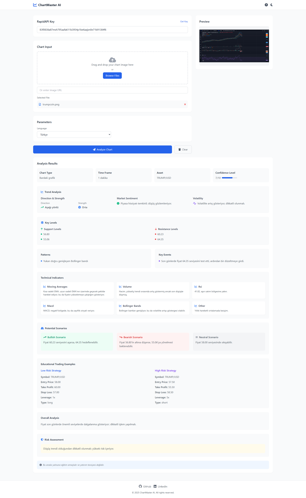

# AI Chart Analysis - Advanced Technical Analysis & Chart Pattern Recognition

AI Chart Analysis is a powerful AI-driven technical analysis tool that helps traders and analysts extract detailed insights from financial charts. Using advanced machine learning algorithms, it provides comprehensive analysis of chart patterns, trends, support/resistance levels, and potential trading scenarios.

## Features

- **Instant Chart Analysis**: Upload your chart image or provide a URL for immediate analysis
- **Multi-Language Support**: Analysis available in 30+ languages
- **Comprehensive Analysis Including**:
  - Chart type and time frame identification
  - Trend direction and strength analysis
  - Support and resistance levels
  - Technical indicators (RSI, MACD, Moving Averages, etc.)
  - Pattern recognition
  - Market sentiment analysis
  - Volatility assessment
  - Risk analysis
  - Educational trading examples

## Technical Details

- Built with modern web technologies
- Responsive design that works on all devices
- Dark/Light mode support
- State persistence using URL hash
- Real-time preview functionality
- Drag-and-drop file upload support

## API Integration

The project uses the AI Chart Analysis API from RapidAPI. To use the application:
1. Get your API key from: https://rapidapi.com/ltdbilgisam/api/chartmaster-ai-visual-stock-chart-technical-analysis
2. Enter your API key in the application
3. Upload a chart or provide an image URL
4. Select your preferred language
5. Click "Analyze Chart" to get detailed insights

## Educational Purpose

This tool is designed for educational purposes and provides:
- Low and high-risk trading scenarios
- Entry/exit points analysis
- Risk assessment
- Educational trading examples
- Comprehensive technical analysis explanations

## Disclaimer

The analysis provided by AI Chart Analysis is for educational purposes only and should not be considered as financial advice. Always conduct your own research and consult with financial professionals before making investment decisions.
